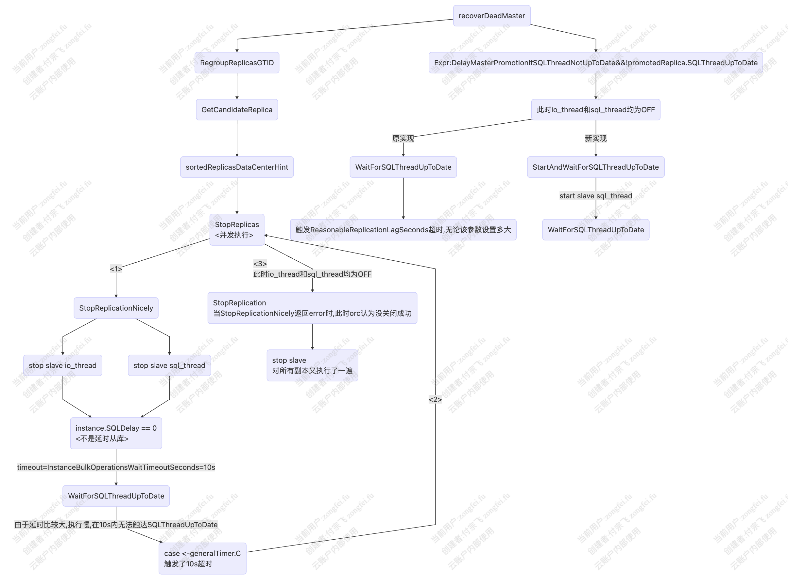

- [Issues地址](#issues地址)
- [复现方式](#复现方式)
	- [日志输出](#日志输出)
	- [查看general log](#查看general-log)
	- [逻辑分析](#逻辑分析)
	- [修改代码](#修改代码)
		- [封装一个新的函数](#封装一个新的函数)
		- [引用替换](#引用替换)
	- [验证](#验证)

## Issues地址
https://github.com/openark/orchestrator/issues/1430


## 复现方式
1. 使用sysbench进行压力测试
2. 在所有的副本上执行stop slave sql_thread
3. 等待3分钟（等待时间小于ReasonableReplicationLagSeconds)
4. 在所有的副本上执行start slave sql_thread（此时所有的副本都是延时的）
5. 在主节点上执行shutdown
6. orchestrator选择一个候选的副本

### 日志输出
> 日志里面加了一些自定义的输出
```bash
2022-05-18 10:36:00 ERROR InstanceBulkOperationsWaitTimeoutSeconds等待超时 on 10.10.1.222:3306
2022-05-18 10:36:00 ERROR WaitForSQLThreadUpToDate timeout on 10.10.1.222:3306 after duration 10s
2022-05-18 10:36:00 INFO StopReplicas: 2.....开始停止副本 on {Key:10.10.1.222:3306 InstanceAlias: Uptime:36535 ServerID:2223306 ServerUUID:86b6522d-b9a8-11ec-8e5d-5254004d77d3 Version:5.7.32-35-log VersionComment:Percona Server (GPL), Release 35, Revision 5688520 FlavorName:Percona ReadOnly:true Binlog_format:ROW BinlogRowImage:FULL LogBinEnabled:true LogSlaveUpdatesEnabled:false LogReplicationUpdatesEnabled:true SelfBinlogCoordinates:mysql-bin.000003:199803571 MasterKey:10.10.1.220:3306 MasterUUID:10acec94-b9a8-11ec-999b-5254004d77d3 AncestryUUID:10acec94-b9a8-11ec-999b-5254004d77d3,86b6522d-b9a8-11ec-8e5d-5254004d77d3 IsDetachedMaster:false Slave_SQL_Running:false ReplicationSQLThreadRuning:true Slave_IO_Running:false ReplicationIOThreadRuning:false ReplicationSQLThreadState:1 ReplicationIOThreadState:2 HasReplicationFilters:false GTIDMode:ON SupportsOracleGTID:true UsingOracleGTID:true UsingMariaDBGTID:false UsingPseudoGTID:false ReadBinlogCoordinates:mysql-bin.000007:962308785 ExecBinlogCoordinates:mysql-bin.000007:194513477 IsDetached:false RelaylogCoordinates:mysql-relay-bin.000003:194513690 LastSQLError: LastIOError:"error reconnecting to master 'repler@10.10.1.220:3306' - retry-time: 60  retries: 1" SecondsBehindMaster:{Int64:231 Valid:true} SQLDelay:0 ExecutedGtidSet:10acec94-b9a8-11ec-999b-5254004d77d3:1-35642,
8d1d41f2-b9a8-11ec-9e42-5254004d77d3:1-1330 GtidPurged:10acec94-b9a8-11ec-999b-5254004d77d3:1-1080 GtidErrant: masterExecutedGtidSet: SlaveLagSeconds:{Int64:0 Valid:false} ReplicationLagSeconds:{Int64:230 Valid:true} SlaveHosts:map[] Replicas:map[] ClusterName:10.10.1.220:3306 SuggestedClusterAlias:mha_rd_tt DataCenter:ali Region:cn-north-3 PhysicalEnvironment:prod ReplicationDepth:1 IsCoMaster:false HasReplicationCredentials:true ReplicationCredentialsAvailable:true SemiSyncAvailable:true SemiSyncPriority:0 SemiSyncMasterEnabled:false SemiSyncReplicaEnabled:true SemiSyncMasterTimeout:10000 SemiSyncMasterWaitForReplicaCount:1 SemiSyncMasterStatus:false SemiSyncMasterClients:0 SemiSyncReplicaStatus:true LastSeenTimestamp:2022-05-18 10:35:48 IsLastCheckValid:true IsUpToDate:true IsRecentlyChecked:true SecondsSinceLastSeen:{Int64:2 Valid:true} CountMySQLSnapshots:0 IsCandidate:false PromotionRule:neutral IsDowntimed:false DowntimeReason: DowntimeOwner: DowntimeEndTimestamp: ElapsedDowntime:0s UnresolvedHostname: AllowTLS:false Problems:[not_replicating] LastDiscoveryLatency:26.998884ms seed:false ReplicationGroupName: ReplicationGroupIsSinglePrimary:false ReplicationGroupMemberState: ReplicationGroupMemberRole: ReplicationGroupMembers:map[] ReplicationGroupPrimaryInstanceKey::0}
2022-05-18 10:36:00 DEBUG WaitForSQLThreadUpToDate waiting on 10.10.1.221:3306
2022-05-18 10:36:01 INFO Stopped replication on 10.10.1.222:3306, Self:mysql-bin.000003:261578818, Exec:mysql-bin.000007:256290289
2022-05-18 10:36:01 ERROR InstanceBulkOperationsWaitTimeoutSeconds等待超时 on 10.10.1.221:3306
2022-05-18 10:36:01 ERROR WaitForSQLThreadUpToDate timeout on 10.10.1.221:3306 after duration 10s
2022-05-18 10:36:01 INFO StopReplicas: 2.....开始停止副本 on {Key:10.10.1.221:3306 InstanceAlias: Uptime:19866 ServerID:2213306 ServerUUID:8d1d41f2-b9a8-11ec-9e42-5254004d77d3 Version:5.7.32-35-log VersionComment:Percona Server (GPL), Release 35, Revision 5688520 FlavorName:Percona ReadOnly:true Binlog_format:ROW BinlogRowImage:FULL LogBinEnabled:true LogSlaveUpdatesEnabled:false LogReplicationUpdatesEnabled:true SelfBinlogCoordinates:mysql-bin.000002:189149175 MasterKey:10.10.1.220:3306 MasterUUID:10acec94-b9a8-11ec-999b-5254004d77d3 AncestryUUID:10acec94-b9a8-11ec-999b-5254004d77d3,8d1d41f2-b9a8-11ec-9e42-5254004d77d3 IsDetachedMaster:false Slave_SQL_Running:false ReplicationSQLThreadRuning:true Slave_IO_Running:false ReplicationIOThreadRuning:false ReplicationSQLThreadState:1 ReplicationIOThreadState:2 HasReplicationFilters:false GTIDMode:ON SupportsOracleGTID:true UsingOracleGTID:true UsingMariaDBGTID:false UsingPseudoGTID:false ReadBinlogCoordinates:mysql-bin.000007:962308785 ExecBinlogCoordinates:mysql-bin.000007:189408146 IsDetached:false RelaylogCoordinates:mysql-relay-bin.000002:188692293 LastSQLError: LastIOError:"error reconnecting to master 'repler@10.10.1.220:3306' - retry-time: 60  retries: 1" SecondsBehindMaster:{Int64:192 Valid:true} SQLDelay:0 ExecutedGtidSet:10acec94-b9a8-11ec-999b-5254004d77d3:1-35631,
8d1d41f2-b9a8-11ec-9e42-5254004d77d3:1-1330 GtidPurged:10acec94-b9a8-11ec-999b-5254004d77d3:1-1080 GtidErrant: masterExecutedGtidSet: SlaveLagSeconds:{Int64:0 Valid:false} ReplicationLagSeconds:{Int64:191 Valid:true} SlaveHosts:map[] Replicas:map[] ClusterName:10.10.1.220:3306 SuggestedClusterAlias:mha_rd_tt DataCenter:hw Region:cn-north-1 PhysicalEnvironment:prod ReplicationDepth:1 IsCoMaster:false HasReplicationCredentials:true ReplicationCredentialsAvailable:true SemiSyncAvailable:true SemiSyncPriority:0 SemiSyncMasterEnabled:false SemiSyncReplicaEnabled:false SemiSyncMasterTimeout:10000 SemiSyncMasterWaitForReplicaCount:1 SemiSyncMasterStatus:false SemiSyncMasterClients:0 SemiSyncReplicaStatus:false LastSeenTimestamp:2022-05-18 10:35:48 IsLastCheckValid:true IsUpToDate:true IsRecentlyChecked:true SecondsSinceLastSeen:{Int64:2 Valid:true} CountMySQLSnapshots:0 IsCandidate:false PromotionRule:neutral IsDowntimed:false DowntimeReason: DowntimeOwner: DowntimeEndTimestamp: ElapsedDowntime:0s UnresolvedHostname: AllowTLS:false Problems:[not_replicating] LastDiscoveryLatency:23.153027ms seed:false ReplicationGroupName: ReplicationGroupIsSinglePrimary:false ReplicationGroupMemberState: ReplicationGroupMemberRole: ReplicationGroupMembers:map[] ReplicationGroupPrimaryInstanceKey::0}
```

### 查看general log
```bash
866 Connect   orch@127.0.0.1 on
                 866 Query     stop slave io_thread
                 866 Query     start slave sql_thread
                 866 Query     stop slave
```

### 逻辑分析
> 简单画的流程图，不一定准确，大致齐


### 修改代码
通过上面逻辑分析，我们可以对代码进行调整。
调整逻辑，在执行WaitForSQLThreadUpToDate时，先执行start slave sql_thread

#### 封装一个新的函数
代码位置: `go/inst/instance_topology_dao.go`
```go 
// StartAndWaitForSQLThreadUpToDate starts a replica
// It will actually START the sql_thread even if the replica is completely stopped.
// And will wait for sql thread up to date
func StartAndWaitForSQLThreadUpToDate(instanceKey *InstanceKey, overallTimeout time.Duration, staleCoordinatesTimeout time.Duration) (*Instance, error) {
	instance, err := ReadTopologyInstance(instanceKey)
	if err != nil {
		return instance, log.Errore(err)
	}

	if !instance.ReplicationThreadsExist() {
		return instance, fmt.Errorf("instance is not a replica: %+v", instanceKey)
	}

	// start sql_thread but catch any errors
	for _, cmd := range []string{`start slave sql_thread`} {
		if _, err := ExecInstance(instanceKey, cmd); err != nil {
			return nil, log.Errorf("%+v: StartReplicationAndWaitForSQLThreadUpToDate: '%q' failed: %+v", *instanceKey, cmd, err)
		}
	}

	if instance.SQLDelay == 0 {
		// Otherwise we don't bother.
		if instance, err = WaitForSQLThreadUpToDate(instanceKey, overallTimeout, staleCoordinatesTimeout); err != nil {
			return instance, err
		}
	}

	instance, err = ReadTopologyInstance(instanceKey)
	log.Infof("Started replication and wait for sql_thread up to date on %+v, Read:%+v, Exec:%+v", *instanceKey, instance.ReadBinlogCoordinates, instance.ExecBinlogCoordinates)
	return instance, err
}
```

#### 引用替换
代码位置: `go/logic/topology_recovery.go`
```go 
if config.Config.DelayMasterPromotionIfSQLThreadNotUpToDate && !promotedReplica.SQLThreadUpToDate() {
			AuditTopologyRecovery(topologyRecovery, fmt.Sprintf("DelayMasterPromotionIfSQLThreadNotUpToDate: waiting for SQL thread on %+v", promotedReplica.Key))
			if _, err := inst.StartAndWaitForSQLThreadUpToDate(&promotedReplica.Key, 0, 0); err != nil {
				return nil, fmt.Errorf("DelayMasterPromotionIfSQLThreadNotUpToDate error: %+v", err)
			}
			AuditTopologyRecovery(topologyRecovery, fmt.Sprintf("DelayMasterPromotionIfSQLThreadNotUpToDate: SQL thread caught up on %+v", promotedReplica.Key))
		}


if config.Config.DelayMasterPromotionIfSQLThreadNotUpToDate {
			AuditTopologyRecovery(topologyRecovery, fmt.Sprintf("Waiting to ensure the SQL thread catches up on %+v", promotedReplica.Key))
			if _, err := inst.StartAndWaitForSQLThreadUpToDate(&promotedReplica.Key, 0, 0); err != nil {
				return promotedReplica, lostReplicas, err
			}
			AuditTopologyRecovery(topologyRecovery, fmt.Sprintf("SQL thread caught up on %+v", promotedReplica.Key))
		}
```

### 验证
重复上面的复现方式，发现结果符合预期