- [提的issue](#提的issue)
- [触发条件](#触发条件)
- [触发时机](#触发时机)
- [分析](#分析)
  - [实例拓扑状态更新过程](#实例拓扑状态更新过程)
  - [bug如何出现的](#bug如何出现的)
- [复现bug](#复现bug)
  - [拓扑](#拓扑)
  - [打调试代码](#打调试代码)
  - [重新运行orchestrator](#重新运行orchestrator)
  - [将Master节点shutdown](#将master节点shutdown)
  - [观察拓扑](#观察拓扑)
  - [观察Recovery日志](#观察recovery日志)
  - [观察ORC表的记录](#观察orc表的记录)
- [修复方法](#修复方法)
- [验证](#验证)

## 提的issue
https://github.com/openark/orchestrator/issues/1455

## 触发条件
触发条件:
* PreventCrossRegionMasterFailover为true
* PreventCrossDataCenterMasterFailover为true

满足任意一个或者同时启用

## 触发时机
看DBA的运气，运气不好，只能背锅。

## 分析
> 首先我们要清楚orchestrator的工作机制，orc有2个goroutine，一个负责实时采集更新实例状态，一个基于数据实时监听实例状态进行failover的

### 实例拓扑状态更新过程
> 可能有表达不准确的地方，不要在乎细节
先看下实例状态更新过程
1. ORC会每秒读取拓扑内的实例（ReadTopologyInstanceBufferable）
2. ORC扫描实例的状态，执行show slave status
3. 如果扫描没有问题，ORC将当前实例的instanceFound设置为true，否则为false
   ...问题出现在这里...
4. 然后ORC在执行DetectRegionQuery、DetectDataCenterQuery等操作（非匹配配置文件正则部分）
5. 最后将当前实例的信息（instanceFound=true）更新到表database_instance

### bug如何出现的
> 结合上面的【实例拓扑状态更新过程】看下

1. 当ORC扫描实例状态时，此时Master节点是正常的，此时ORC会标记当前Master节点instanceFound=true
2. 扫描完成后，Master节点突然shutdown或者其他不可达的故障
3. 此时ORC会继续执行DetectRegionQuery、DetectDataCenterQuery等操作（非匹配配置文件正则部分）
4. 这时第三步的操作是读取当前Master的表cluster，这里Master节点已经宕机了，自然获取不到结果了
5. 将空值更新到表orchestrator.database_instance，可以看到Master节点region为空了
   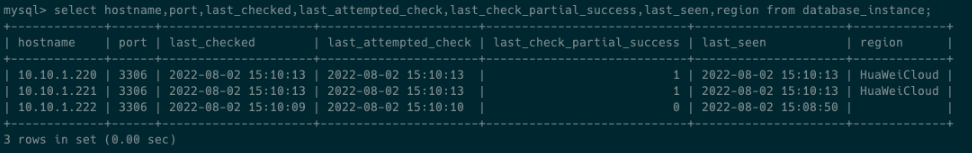
6. 这时在进行Failover，就会导致analysisEntry.AnalyzedInstanceRegion值为空，导致region或datacenter验证不通过，故障转移失败
   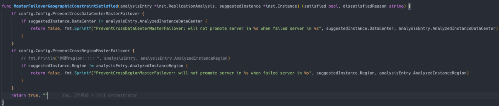


## 复现bug
这个bug看起来触发几率比较小，但是一旦触发，问题就会很严重。

### 拓扑
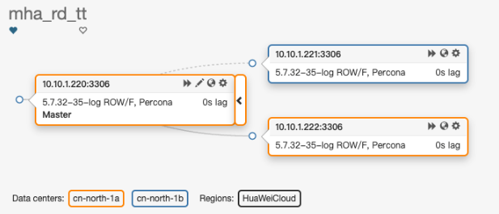

### 打调试代码
代码文件：go/inst/instance_dao.go
在instanceFound = true下面增加for循环（你想多少秒都行，不要太大，太大检测过慢，效果显现慢）
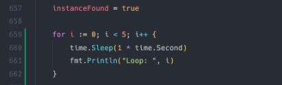

### 重新运行orchestrator
```bash
go run go/cmd/orchestrator/main.go -config conf/orchestrator.conf.json  -debug http
```

### 将Master节点shutdown
这里要选好时机，时机就是调试代码的5秒逻辑，shutdown命令要在循环Loop 5秒期间执行
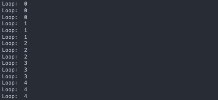

### 观察拓扑
> 只要符合触发过程，主库宕机，即使不在`RecoveryPeriodBlockSeconds`阻塞时间内，也是会恢复失败的

此时拓扑恢复失败了，恢复失败会形成级联拓扑
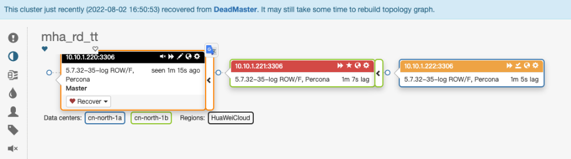

### 观察Recovery日志
发现问题复现了，orchestrator判断region时，值为空，恢复失败。
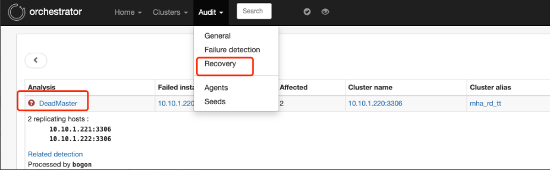
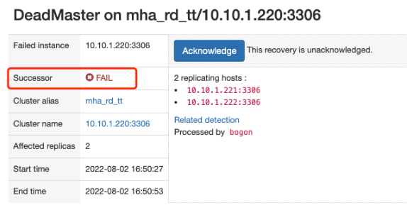
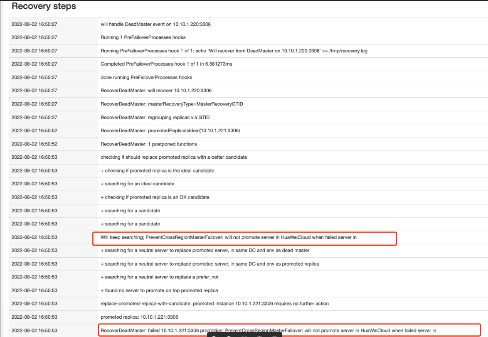

### 观察ORC表的记录
发现宕机的Master节点10.10.1.220对应的region记录为空了
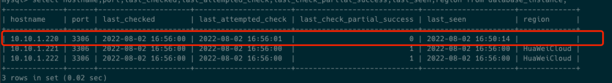

## 修复方法
其实修复起来已经很简单了，调整下DetectRegionQuery代码顺序即可
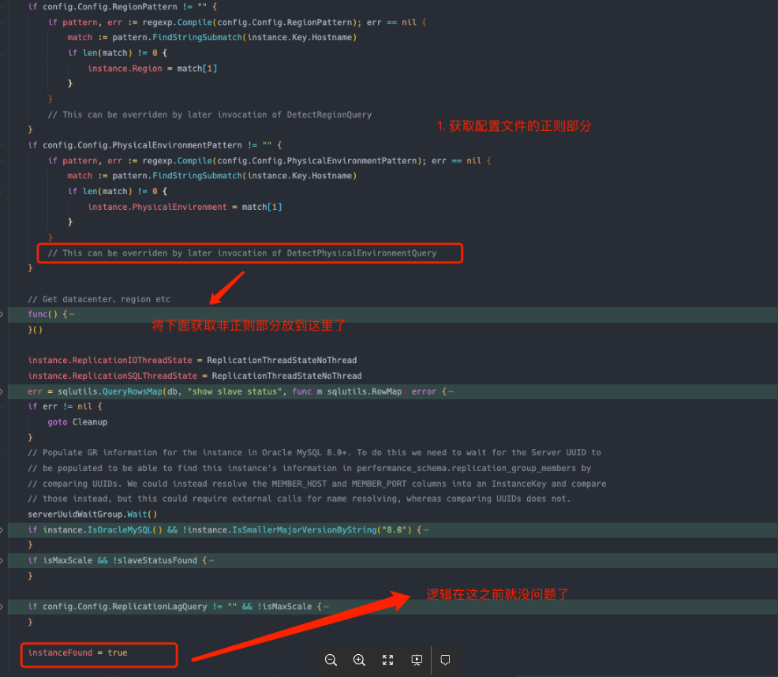

添加代码的位置
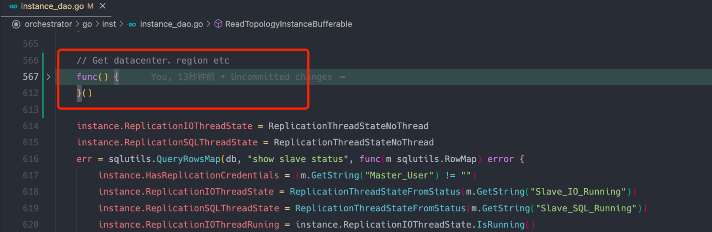

补充的代码
```go
// Get datacenter、region etc
func() {
    var getMetaWaitGroup sync.WaitGroup
    if config.Config.DetectDataCenterQuery != "" && !isMaxScale {
        getMetaWaitGroup.Add(1)
        go func() {
            defer getMetaWaitGroup.Done()
            err := db.QueryRow(config.Config.DetectDataCenterQuery).Scan(&instance.DataCenter)
            logReadTopologyInstanceError(instanceKey, "DetectDataCenterQuery", err)
        }()
    }
    if config.Config.DetectRegionQuery != "" && !isMaxScale {
        getMetaWaitGroup.Add(1)
        go func() {
            defer getMetaWaitGroup.Done()
            err := db.QueryRow(config.Config.DetectRegionQuery).Scan(&instance.Region)
            logReadTopologyInstanceError(instanceKey, "DetectRegionQuery", err)
        }()
    }
    if config.Config.DetectPhysicalEnvironmentQuery != "" && !isMaxScale {
        getMetaWaitGroup.Add(1)
        go func() {
            defer getMetaWaitGroup.Done()
            err := db.QueryRow(config.Config.DetectPhysicalEnvironmentQuery).Scan(&instance.PhysicalEnvironment)
            logReadTopologyInstanceError(instanceKey, "DetectPhysicalEnvironmentQuery", err)
        }()
    }
 
    if config.Config.DetectInstanceAliasQuery != "" && !isMaxScale {
        getMetaWaitGroup.Add(1)
        go func() {
            defer getMetaWaitGroup.Done()
            err := db.QueryRow(config.Config.DetectInstanceAliasQuery).Scan(&instance.InstanceAlias)
            logReadTopologyInstanceError(instanceKey, "DetectInstanceAliasQuery", err)
        }()
    }
 
    if config.Config.DetectSemiSyncEnforcedQuery != "" && !isMaxScale {
        getMetaWaitGroup.Add(1)
        go func() {
            defer getMetaWaitGroup.Done()
            err := db.QueryRow(config.Config.DetectSemiSyncEnforcedQuery).Scan(&instance.SemiSyncPriority)
            logReadTopologyInstanceError(instanceKey, "DetectSemiSyncEnforcedQuery", err)
        }()
    }
    getMetaWaitGroup.Wait()
}()
```

## 验证
请按照上面的复现方法进行操作，发现未在出现，结果符合预期。