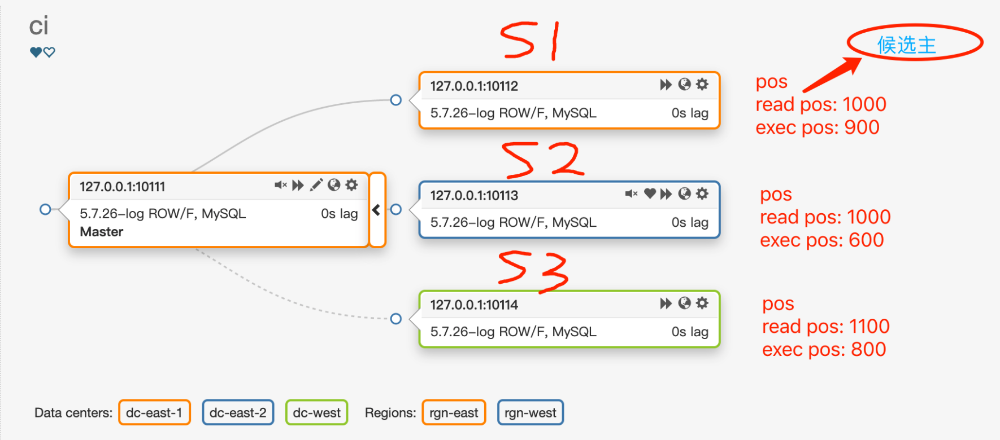

- [默认选择候选主方法](#默认选择候选主方法)
- [拓扑图](#拓扑图)
- [分析](#分析)
  - [基于ExecBinlogCoordinates选择候选主](#基于execbinlogcoordinates选择候选主)
  - [基于ReadBinlogCoordinates选择候选主](#基于readbinlogcoordinates选择候选主)
- [代码调整](#代码调整)
- [验证方法](#验证方法)
  - [主库开启模拟数据写入](#主库开启模拟数据写入)
  - [从库S1进行锁表、阻塞sql_thread](#从库s1进行锁表阻塞sql_thread)
  - [从库S2模拟网络延时，阻塞](#从库s2模拟网络延时阻塞)
  - [主库shutdown](#主库shutdown)
  - [立即恢复从库S2网络延时](#立即恢复从库s2网络延时)
  - [解除从库S1锁定](#解除从库s1锁定)
  - [结论分析](#结论分析)
## 默认选择候选主方法
```go
// sortInstances shuffles given list of instances according to some logic
func sortInstancesDataCenterHint(instances [](*Instance), dataCenterHint string) {
    sort.Sort(sort.Reverse(NewInstancesSorterByExec(instances, dataCenterHint)))
}
```
从`NewInstancesSorterByExec`实现可以看出ORC基于`ExecBinlogCoordinates`选择候选主，即哪个副本执行到的坐标最新，就选择哪个副本。
如果所有的副本开启了增强半同步，且rpl_semi_sync_master_wait_for_slave_count等于副本的数量，此时这种选举方法是可靠的。

## 拓扑图
> 仅借拓扑图一用，图上datacenter/region标识在此不作参考


条件:
- 开启了增强半同步（下图中S3最后响应了ACK，即主节点的pos为1100）
- rpl_semi_sync_master_wait_for_slave_count = 1 

## 分析
### 基于ExecBinlogCoordinates选择候选主
orc默认是基于`ExecBinlogCoordinates`选择候选主，如果主节点发生故障，此时S1的`exec pos`最靠前，因此orc会选择S1做为候选主库，然后提升S1为新的主，但是此时S3拥有的是最新和最全的数据。
此时会发生丢数据的行为，丢的数据pos范围为：（1100 - 1000）= 100 个pos坐标的数据


### 基于ReadBinlogCoordinates选择候选主
为了解决上面的问题，引入了基于`ReadBinlogCoordinates`机制选择候选主。
注意，只是增加了`ReadBinlogCoordinates`比较，原来的`ExecBinlogCoordinates`机制并未移除，当`ReadBinlogCoordinates`最新的会放在数组的最前面。

## 代码调整
代码位置: `go/inst/instance_utils.go`
```go
import (
    "github.com/openark/orchestrator/go/config"
    ...
)

...
func (this *InstancesSorterByExec) Less(i, j int) bool {
    // Returning "true" in this function means [i] is "smaller" than [j],
    // which will lead to [j] be a better candidate for promotion
 
    // Sh*t happens. We just might get nil while attempting to discover/recover
    if this.instances[i] == nil {
        return false
    }
    if this.instances[j] == nil {
        return true
    }
    // 将原代码封装为函数
    isSmallerExecBinlogCoordinates := func(i, j int) bool {
        if this.instances[i].ExecBinlogCoordinates.Equals(&this.instances[j].ExecBinlogCoordinates) {
            // Secondary sorting: "smaller" if not logging replica updates
            if this.instances[j].LogReplicationUpdatesEnabled && !this.instances[i].LogReplicationUpdatesEnabled {
                return true
            }
            // Next sorting: "smaller" if of higher version (this will be reversed eventually)
            // Idea is that given 5.6 a& 5.7 both of the exact position, we will want to promote
            // the 5.6 on top of 5.7, as the other way around is invalid
            if this.instances[j].IsSmallerMajorVersion(this.instances[i]) {
                return true
            }
            // Next sorting: "smaller" if of larger binlog-format (this will be reversed eventually)
            // Idea is that given ROW & STATEMENT both of the exact position, we will want to promote
            // the STATEMENT on top of ROW, as the other way around is invalid
            if this.instances[j].IsSmallerBinlogFormat(this.instances[i]) {
                return true
            }
            // Prefer local datacenter:
            if this.instances[j].DataCenter == this.dataCenter && this.instances[i].DataCenter != this.dataCenter {
                return true
            }
            // Prefer if not having errant GTID
            if this.instances[j].GtidErrant == "" && this.instances[i].GtidErrant != "" {
                return true
            }
            // Prefer candidates:
            if this.instances[j].PromotionRule.BetterThan(this.instances[i].PromotionRule) {
                return true
            }
        }
        return this.instances[i].ExecBinlogCoordinates.SmallerThan(&this.instances[j].ExecBinlogCoordinates)
    }
    // 调用
    if config.Config.MinimiseDataLoss {
        if this.instances[i].ReadBinlogCoordinates.Equals(&this.instances[j].ReadBinlogCoordinates) {
            return isSmallerExecBinlogCoordinates(i, j)
        }
        return this.instances[i].ReadBinlogCoordinates.SmallerThan(&this.instances[j].ReadBinlogCoordinates)
    }
    return isSmallerExecBinlogCoordinates(i, j)
}
...
```

代码位置: `go/inst/instance_topology.go`
```go
for _, replica := range replicas {
        replica := replica
        if canReplicate, err := replica.CanReplicateFrom(candidateReplica); !canReplicate {
            // lost due to inability to replicate
            cannotReplicateReplicas = append(cannotReplicateReplicas, replica)
            if err != nil {
                log.Errorf("chooseCandidateReplica(): error checking CanReplicateFrom(). replica: %v; error: %v", replica.Key, err)
            }
        } else if replica.ExecBinlogCoordinates.SmallerThan(&candidateReplica.ExecBinlogCoordinates) {
            laterReplicas = append(laterReplicas, replica)
        } else if replica.ExecBinlogCoordinates.Equals(&candidateReplica.ExecBinlogCoordinates) {
            equalReplicas = append(equalReplicas, replica)
        } else {
            // lost due to being more advanced/ahead of chosen replica.
            if config.Config.MinimiseDataLoss && config.Config.DelayMasterPromotionIfSQLThreadNotUpToDate {
                if replica.ReadBinlogCoordinates.SmallerThanOrEquals(&candidateReplica.ReadBinlogCoordinates) {
                    log.Debugf("Because MinimiseDataLoss is true. so although replica %+v is more-up-to-date than %+v, we still put it into laterReplicas", replica.Key, candidateReplica.Key)
                    laterReplicas = append(laterReplicas, replica)
                } else {
                    aheadReplicas = append(aheadReplicas, replica)
                }
            } else {
                aheadReplicas = append(aheadReplicas, replica)
            }
        }
    }
```

代码位置: `go/config/config.go`
```go
// 增加参数
MinimiseDataLoss                           bool           
```

## 验证方法
> 1主2备

### 主库开启模拟数据写入
```bash
mysqlslap \
-h127.0.0.1 \
-uroot \
-p1234.com \
--concurrency=10 \
--iterations=1 \
--auto-generate-sql \
--auto-generate-sql-load-type=mixed \
--auto-generate-sql-add-autoincrement \
--engine=innodb \
--number-of-queries=50000000
```

### 从库S1进行锁表、阻塞sql_thread


不要退出会话


```bash
use mysqlslap;
begin;lock table t1 read;
```
此时锁定mysqlslap.t1表，当前库的sql_thread会阻塞，Exec_Master_Log_Pos位置会不变。
但是此时的io_thread是正常的，可以正常响应主库的ack,此时可以发现有延时产生。

### 从库S2模拟网络延时，阻塞
调整下slave_net_timeout
```sql
set global slave_net_timeout=180;stop slave;start slave;
```

将网络请求延时180s
> 172.28.128.8为主库的ip地址172.28.128.8为主库的ip地址
```bash
tc qdisc del dev eth1 root 
tc qdisc add dev eth1 root handle 1: prio
tc filter add dev eth1 protocol ip parent 1: prio 1 u32 match ip dst 172.28.128.8 flowid 1:1
tc filter add dev eth1 protocol all parent 1: prio 2 u32 match ip dst 0.0.0.0/0 flowid 1:2
tc filter add dev eth1 protocol all parent 1: prio 2 u32 match ip protocol 1 0xff flowid 1:2
tc qdisc add dev eth1 parent 1:1 handle 10: netem delay 180000ms
tc qdisc add dev eth1 parent 1:2 handle 20: sfq
```

此时执行`show slave status`会发现`Read_Master_Log_Pos`不变了, 当前从库收不到`binlog event`了。
但是此时`io_thread`是`YE`S（未触发`slave_net_timeout`）。

此时可以发现有延时产生,我们会发现从库`S1`的`GTID`小于从库`S2`，但是从库`S1`的`GTID`是全的，因为一直在从主库拉取`binlog`，尽管还没调用`sql_thread`执行。而从库`S2`的`GTID`是不全的，因为本地的`io_thread`已经获取不到最新的`binlog`了。

### 主库shutdown
> 当2台都有延时产生后，且不大于100

```bash
mysql -uroot -p1234.com -h127.0.0.1 -e 'shutdown'
```

### 立即恢复从库S2网络延时
```bash
tc qdisc del dev eth1 root ;
```

### 解除从库S1锁定
退出会话即可

### 结论分析
- 如果基于ExecBinlogCoordinates选择候选主，此时`S2`会被提升为`Master`，导致丢数据
- 如果基于ReadBinlogCoordinates选择候选主，此时`S1`会被提升为`Master`，不丢数据