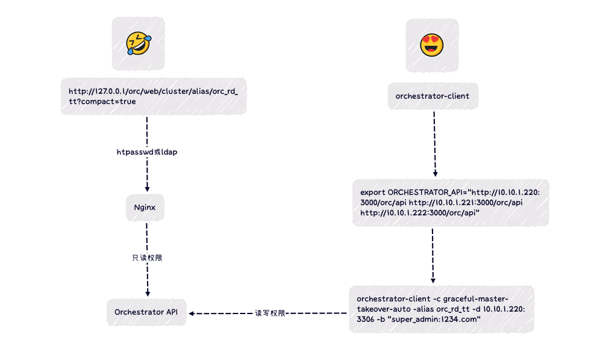
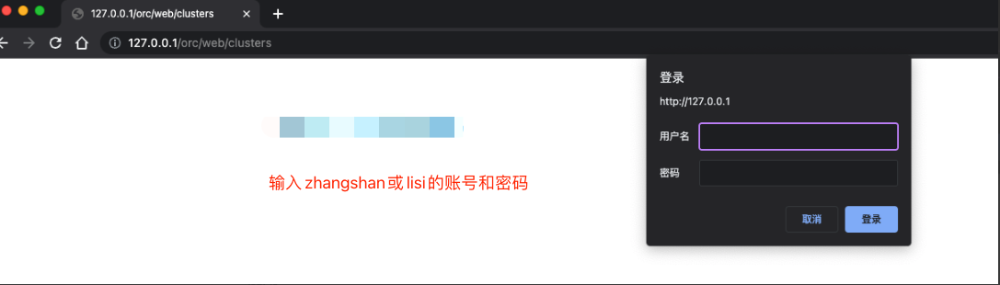

- [需求](#需求)
- [改进方案](#改进方案)
  - [拓扑](#拓扑)
  - [修改代码](#修改代码)
  - [加密密码的go代码](#加密密码的go代码)
  - [ORC参数配置](#orc参数配置)
  - [Nginx配置](#nginx配置)
  - [测试访问](#测试访问)
    - [web访问](#web访问)
    - [测试orchestrator-client访问](#测试orchestrator-client访问)

## 需求
> 抛砖引玉，可以根据自己业务场景进行魔改

orc自带的访问认证模式太弱
- Web UI只读【可以支持LDAP】
- 支持super账号读写

参考文档
Percona这个文档实现的太牵强了，存在绕过的风险。
如果获取到了orc的地址，用户名是不需要密码就能执行读写操作（这里是action，我们姑且叫做读写操作吧）。
文档地址：[configuring-a-read-only-web-interface-for-orchestrator](https://www.percona.com/blog/2020/03/06/configuring-a-read-only-web-interface-for-orchestrator/)

## 改进方案
### 拓扑


### 修改代码
代码位置: `go/http/httpbase.go`
```go
import (
    ...
    "golang.org/x/crypto/bcrypt"
)
  
func PasswordVerify(pwd, hash string) bool {
    err := bcrypt.CompareHashAndPassword([]byte(hash), []byte(pwd))
    return err == nil
}
  
// 验证request请求里面的账号密码
func verifyProxyAuthUser(req *http.Request) bool {
    // 这里的basic auth不是orc里面的basic auth
    authUser, authPassword, ok := req.BasicAuth()
    if ok {
        for _, configPowerAuthUser := range config.Config.PowerAuthUsers {
            if configPowerAuthUser == "*" {
                return false
            }
            var powerAuthUserInfo = strings.Split(configPowerAuthUser, ":")
            if len(powerAuthUserInfo) != 2 {
                return false
            }
            powerAuthUser := powerAuthUserInfo[0]
            powerAuthHashPass := powerAuthUserInfo[1]
            if powerAuthUser == authUser && PasswordVerify(authPassword, powerAuthHashPass) {
                return true
            }
        }
        return false
    }
    return false
}
  
func isAuthorizedForAction(req *http.Request, user auth.User) bool {
...
case "proxy":
        {
            // 使用新的方法
            return verifyProxyAuthUser(req)
        }
...
}
```

### 加密密码的go代码
> 自己创建个test.go文件，输入明文密码加密即可


```go
// 使用下面方法加密明文密码
func PasswordHash(pwd string) {
 byte, err := bcrypt.GenerateFromPassword([]byte(pwd), bcrypt.DefaultCost)
 if err != nil {
     fmt.Println(err)
 }
 // 输出加密后的密码
 fmt.Println(string(byte))
}
```

### ORC参数配置


PowerAuthUsers账号用于读写，应该唯一，不应配置在nginx的htpasswd或ldap里面
Nginx的账号仅用于UI只读，不应和PowerAuthUsers的用户名和密码一致，否则页面会有读写权限


```json
"AuthenticationMethod": "proxy",
"HTTPAuthUser": "",
"HTTPAuthPassword": "",
"AuthUserHeader": "X-Auth-User",
"PowerAuthUsers": [
  "super_admin:$2a$10$meiraEKVQr4iSS3CnUrRQud2bspZojmjxZXBh0X5YLhsHhWhuOgEq",
],
"URLPrefix": "/orc",
"StatusEndpoint": "/orc/api/status",
```
- `HTTPAuthUser`和`HTTPAuthPassword`不需要指定
- 密文`$2a$10$meiraEKVQr4iSS3CnUrRQud2bspZojmjxZXBh0X5YLhsHhWhuOgEq`是使用`PasswordHash`进行加密的
- `PowerAuthUsers`为orchestrator内部认证方式，具有读写权限的账号

### Nginx配置
> 使用web界面访问，具有只读权限
> 这里使用的是htpass方式，您可以使用ldap认证

`vim /etc/nginx/conf.d/orc.conf`
```ini
server {
    listen      80;
    server_name orc.example.net;   # 此处更换为自己的域名
    charset     utf-8;

    access_log   /var/log/nginx/orc.log;

    location /orc {
        auth_basic            "orc basic auth";     # 描述信息，见名知意即可
        auth_basic_user_file   /etc/nginx/orchestrator.htpasswd;

        proxy_pass_request_headers on;
        proxy_hide_header Authorization;

        set $orchestrator_auth $remote_user;         # remote_user  orchestrator.htpasswd 认证文件解析出来的密码
        if ($uri ~ /orc/web/) {
            set $orchestrator_auth "readonly";
        }

        proxy_set_header X-Auth-User $orchestrator_auth;
        proxy_pass http://orc;
    }

}

upstream orc {
    server 10.10.1.220:3000;
}
```

为用户zhangshan和lisi生成只读的访问账号
```bash
openssl passwd -apr1 1234.com
```

`vim  /etc/nginx/orchestrator.htpasswd`
```ini
zhangshan:$apr1$UQbqy9/6$wTa58vRSWovVIjL2dAjK71
lisi:$apr1$UQbqy9/6$wTa58vRSWovVIjL2dAjK71
```

### 测试访问
#### web访问
> 使用zhangshan或者lisi账号访问web ui



#### 测试orchestrator-client访问
配置api
```bash
# raft 3个节点的地址
export ORCHESTRATOR_API="http://10.10.1.220:3000/orc/api http://10.10.1.221:3000/orc/api http://10.10.1.222:3000/orc/api"
```

访问，使用-b传递用户名和密码（这个用户名和密码不走Nginx配置的认证，走的是ORC的内部认证完成，即配置参数`PowerAuthUsers`）
```bash
orchestrator-client -c graceful-master-takeover-auto -alias mha_rd_tt -d 10.10.1.220:3306 -b "super_admin:1234.com"
```