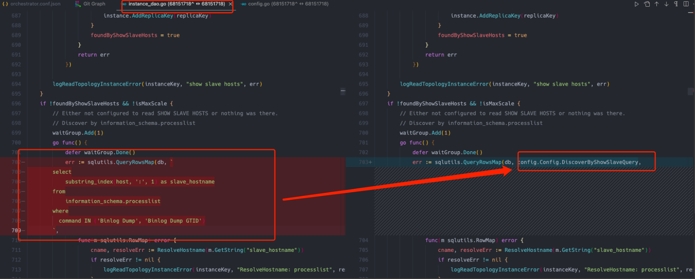

- [配置如何发现从库](#配置如何发现从库)
- [存在的问题](#存在的问题)
- [改进](#改进)
  - [调整代码](#调整代码)
  - [参数配置](#参数配置)
  - [使用](#使用)

## 配置如何发现从库
> 抛转引玉


```json
"DiscoverByShowSlaveHosts": true
```
由参数DiscoverByShowSlaveHosts控制如何发现从库，该参数默认为true

- true
通过show slave hosts发现从库，此时需要从库正确设置了report_host（report_port可以不用被设置，因为report_port默认会被设置成slave的端口）。如果从库没有设置report_host，show slave hosts中的host字段显示为空，则通过processlist发现从库。
- false
通过information_schema.processlist发现从库，命令如下：
select substring_index(host, ':', 1) as slave_hostname from information_schema.processlist where command IN ('Binlog Dump', 'Binlog Dump GTID');
通过information_schema.processlist去发现从库，master无法知道replica监听的是哪个端口。show processlist只会显示复制进程使用的套接字端口，而不是replica实例监听的端口。因此需要从库和主库的监听端口一致

DiscoveryByShowSlaveHosts意义：
- MaxScale不支持PROCESSLIST，因此SHOW SLAVE HOSTS是唯一的选择
- 通过information_schema.processlist去发现从库，master无法知道replica监听的是哪个端口


## 存在的问题
1. 并不是所有的主机都配置了`report_host`，如果从库没有设置`report_host`，`show slave hosts`中的`host字`段显示为空，则通过`processlist`发现从库。
2. 通过`processlist`发现从库，实际上调用的是命令：`select substring_index(host, ':', 1) as slave_hostname from information_schema.processlist where command IN ('Binlog Dump', 'Binlog Dump GTID')`;那么问题来了，`master`无法知道`replica`监听的是哪个端口，也会找出`binlog server`和`canal`等连接到`master`的服务，由于orchestrator支持验证是否为mysql服务，因此这些实例不会被认为是mysql服务。但是这会产生大量的错误输出，非常不友好（强迫症吧，非常不爽大量的错误输出）。

## 改进

### 调整代码
增加配置参数`DiscoverByShowSlaveQuery`

调整代码如下图:


### 参数配置
> 如果您采用了统一的复制用户（如用户：repler），那么就比较方便了，您可以在sql中增加 `AND user ='repler'"`

```json
"DiscoverByShowSlaveHosts": true,
"DiscoverByShowSlaveQuery": "select substring_index(host, ':', 1) as slave_hostname from information_schema.processlist where command IN ('Binlog Dump', 'Binlog Dump GTID') AND user ='repler'",
```

### 使用
当使用discover发现拓扑时，只会找使用repler用户复制的副本
```bash
orchestrator-client -c  discover -i 10.10.1.220:3306 -b 'orc_admin:xxx'
```