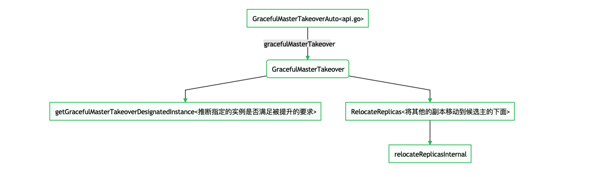

- [手动切换](#手动切换)
- [graceful-master-takeover](#graceful-master-takeover)
  - [2种切换方式](#2种切换方式)
  - [通过以下方式可以实现优雅的切换](#通过以下方式可以实现优雅的切换)
    - [命令行](#命令行)
    - [Web Api](#web-api)
  - [实现流程](#实现流程)
    - [大致流程图](#大致流程图)
    - [恢复步骤](#恢复步骤)
      - [1.检查候选主库是否满足被提升的要求](#1检查候选主库是否满足被提升的要求)
      - [2.将老主库的其他从库移动到候选主库之下](#2将老主库的其他从库移动到候选主库之下)
      - [3.检查复制问题(dead master; unreachable master; etc)](#3检查复制问题dead-master-unreachable-master-etc)
      - [4.调用hooks：PreGracefulTakeoverProcesses](#4调用hookspregracefultakeoverprocesses)
      - [5.在老主库上设置只读(read_only)](#5在老主库上设置只读read_only)
      - [6.等待候选主库追上老主库的BinlogCoordinates](#6等待候选主库追上老主库的binlogcoordinates)
      - [7.进行故障恢复检查](#7进行故障恢复检查)
      - [8.将老主库变成新主库的从库](#8将老主库变成新主库的从库)
      - [9.在老主库上执行start slave(graceful-master-takeover-auto模式)](#9在老主库上执行start-slavegraceful-master-takeover-auto模式)
      - [10.调用hooks: PostGracefulTakeoverProcesses](#10调用hooks-postgracefultakeoverprocesses)

## 手动切换
Orchestrator的Failover大致可以分为`自动切换`和`手动切换`
`手动切换`不受自动切换中提到的条件限制和约束

手动切换分为:
- recover
- recover-lite
- force-master-failover
- force-master-takeover
- graceful-master-takeover

这里大致分析下`graceful-master-takeover`行为，其他的类似，不做过多文章。

## graceful-master-takeover
当前Master正常，需要提升新主库，老主库可作为从库。
通常，出于升级、主机维护等目的，这属于一个优雅的提升。

### 2种切换方式
- `graceful-master-takeover`
用户必须指出要升级的指定副本，降级的主库将作为新主库的副本，但是不会启动复制
- `graceful-master-takeover-auto`
用户可以指示要升级的指定副本，或者当用户不指定副本时，协调器会选择最佳副本进行升级。同时降级的主库将作为新主库的副本，并且在副本上开启复制

### 通过以下方式可以实现优雅的切换
#### 命令行
- orchestrator-client -c graceful-master-takeover -alias mycluster -d designated.master.to.promote:3306
指定要提升的副本，orchestrator不会在降级的主库上开启复制
- orchestrator-client -c graceful-master-takeover-auto -alias mycluster -d designated.master.to.promote:3306
如：orchestrator-client -c graceful-master-takeover-auto -alias geass -d 172.28.128.9:3306
指定要提升的副本，orchestrator会在降级的主库上开启复制
- orchestrator-client -c graceful-master-takeover-auto -alias mycluster:let orchestrator choice
如：orchestrator-client -c graceful-master-takeover-auto -alias geass
自动选择一个要提升的副本，orchestrator会在降级的主库上开启复制

#### Web Api
- /api/graceful-master-takeover/:clusterHint/:designatedHost/:designatedPort
指定要提升的副本，orchestrator不会在降级的主库上开启复制
- /api/graceful-master-takeover/:clusterHint
自动选择一个要提升的副本，orchestrator不会在降级的主库上开启复制
- /api/graceful-master-takeover-auto/:clusterHint
自动选择一个要提升的副本，orchestrator会在降级的主库上开启复制

### 实现流程
orc client会调用函数graceful_master_takeover_auto请求接口/api/graceful-master-takeover-auto/:clusterHint/:designatedHost/:designatedPort

#### 大致流程图


#### 恢复步骤
> 省略了选主、补数据等过程
> 通过了解下面流程，您能了解到`graceful-master-takeover`是如何工作的


##### 1.检查候选主库是否满足被提升的要求
检查涉及到的函数:
- GracefulMasterTakeover
- getGracefulMasterTakeoverDesignatedInstance

要求:
- 至少要有一个副本
- 候选主库必须是集群主库的直连从库
- 候选主库，没有被禁止提升为主库(即promotion rule 不是must not)
- 候选主库的延时没有超过ReasonableMaintenanceReplicationLagSeconds(合理维护滞后的秒数，默认为20s)

##### 2.将老主库的其他从库移动到候选主库之下
通过GTID进行移动，此时形成了级联关系

下面是将从库10.10.1.220:3309移动到候选主库10.10.1.220:3307下面
```bash
2022-01-11 14:46:16 INFO GracefulMasterTakeover: Will let 10.10.1.220:3307 take over its siblings
2022-01-11 14:46:16 INFO moveReplicasViaGTID: Will move 1 replicas below 10.10.1.220:3307 via GTID, max concurrency: 5
2022-01-11 14:46:16 INFO Will move 10.10.1.220:3309 below 10.10.1.220:3307 via GTID
2022-01-11 14:46:16 INFO auditType:begin-maintenance instance:10.10.1.220:3309 cluster:10.10.1.220:3308 message:maintenanceToken: 40, owner: bogon, reason: move below 10.10.1.220:3307
2022-01-11 14:46:16 INFO Stopped replication on 10.10.1.220:3309, Self:mysql-bin.000007:1415, Exec:mysql-bin.000009:1432
2022-01-11 14:46:16 DEBUG ChangeMasterTo: will attempt changing master on 10.10.1.220:3309 to 10.10.1.220:3307, mysql-bin.000007:1472
2022-01-11 14:46:16 INFO ChangeMasterTo: Changed master on 10.10.1.220:3309 to: 10.10.1.220:3307, mysql-bin.000007:1472. GTID: true
2022-01-11 14:46:16 INFO Started replication on 10.10.1.220:3309
```
##### 3.检查复制问题(dead master; unreachable master; etc)
`forceAnalysisEntry` -> `GetReplicationAnalysis`

##### 4.调用hooks：PreGracefulTakeoverProcesses
> 在主库设置为只读之前

日志:
```bash
2022-01-11 14:46:16 INFO GracefulMasterTakeover: Will demote 10.10.1.220:3308 and promote 10.10.1.220:3307 instead
2022-01-11 14:46:16 INFO topology_recovery: Running 1 PreGracefulTakeoverProcesses hooks
2022-01-11 14:46:16 INFO topology_recovery: Running PreGracefulTakeoverProcesses hook 1 of 1: echo 'Planned takeover about to take place on 10.10.1.220:3308. Master will switch to read_only' >> /tmp/recovery.log
2022-01-11 14:46:16 INFO CommandRun(echo 'Planned takeover about to take place on 10.10.1.220:3308. Master will switch to read_only' >> /tmp/recovery.log,[])
2022-01-11 14:46:16 INFO CommandRun/running: bash /var/folders/3b/hwhyphh97w1cwj5k70pb2gd40000gn/T/orchestrator-process-cmd-203014091
2022-01-11 14:46:16 INFO CommandRun: 

2022-01-11 14:46:16 INFO CommandRun successful. exit status 0
2022-01-11 14:46:16 INFO topology_recovery: Completed PreGracefulTakeoverProcesses hook 1 of 1 in 6.994932ms
2022-01-11 14:46:16 INFO topology_recovery: done running PreGracefulTakeoverProcesses hooks
```

##### 5.在老主库上设置只读(read_only)
代码位置：`logic/topology_recovery.go:2175`
日志输出:
```bash
2022-01-11 14:46:16 INFO GracefulMasterTakeover: Will set 10.10.1.220:3308 as read_only
2022-01-11 14:46:16 INFO instance 10.10.1.220:3308 read_only: true
2022-01-11 14:46:16 INFO auditType:read-only instance:10.10.1.220:3308 cluster:10.10.1.220:3308 message:set as true
```

##### 6.等待候选主库追上老主库的BinlogCoordinates
BinlogCoordinates定义:
```go
type BinlogCoordinates struct {
	LogFile string
	LogPos  int64
	Type    BinlogType
}
```

调用函数:WaitForExecBinlogCoordinatesToReach
代码位置：`logic/topology_recovery.go:2179`
日志:
```go
2022-01-11 14:46:16 INFO GracefulMasterTakeover: Will wait for 10.10.1.220:3307 to reach master coordinates mysql-bin.000009:1432
```

##### 7.进行故障恢复检查
`ForceExecuteRecovery`
代码位置：`logic/topology_recovery.go:2187`

##### 8.将老主库变成新主库的从库
代码位置：logic/topology_recovery.go:2207
日志:
```bash
2022-01-11 14:46:19 DEBUG ChangeMasterTo: will attempt changing master on 10.10.1.220:3308 to 10.10.1.220:3307, mysql-bin.000007:1472
2022-01-11 14:46:19 INFO ChangeMasterTo: Changed master on 10.10.1.220:3308 to: 10.10.1.220:3307, mysql-bin.000007:1472. GTID: true
2022-01-11 14:46:19 DEBUG ChangeMasterTo: will attempt changing master credentials on 10.10.1.220:3308
2022-01-11 14:46:19 INFO ChangeMasterTo: Changed master credentials on 10.10.1.220:3308
```

##### 9.在老主库上执行start slave(graceful-master-takeover-auto模式)
日志:
```bash
2022-01-11 14:46:19 INFO Started replication on 10.10.1.220:3308
```

##### 10.调用hooks: PostGracefulTakeoverProcesses
```bash
2022-01-11 14:46:19 INFO topology_recovery: Running 1 PostGracefulTakeoverProcesses hooks
2022-01-11 14:46:19 INFO topology_recovery: Running PostGracefulTakeoverProcesses hook 1 of 1: echo 'Planned takeover complete' >> /tmp/recovery.log
2022-01-11 14:46:19 INFO CommandRun(echo 'Planned takeover complete' >> /tmp/recovery.log,[])
2022-01-11 14:46:19 INFO CommandRun/running: bash /var/folders/3b/hwhyphh97w1cwj5k70pb2gd40000gn/T/orchestrator-process-cmd-812005314
2022-01-11 14:46:19 INFO CommandRun: 

2022-01-11 14:46:19 INFO CommandRun successful. exit status 0
2022-01-11 14:46:19 INFO topology_recovery: Completed PostGracefulTakeoverProcesses hook 1 of 1 in 7.352403ms
2022-01-11 14:46:19 INFO topology_recovery: done running PostGracefulTakeoverProcesses hooks
```