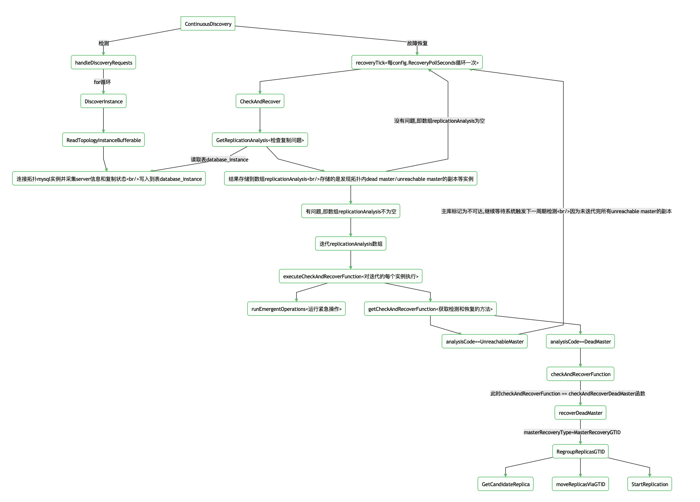

- [自动切换](#自动切换)
- [检查机制](#检查机制)
- [限制和约束](#限制和约束)
- [大致流程图](#大致流程图)
- [恢复步骤](#恢复步骤)
  - [1.探测到主库不可达](#1探测到主库不可达)
  - [2.检查副本状态](#2检查副本状态)
  - [3.进行故障恢复](#3进行故障恢复)
Orchestrator对MySQL主库的故障切换分为`自动切换`和`手动切换`

## 自动切换
自动切换是主库出现故障后，自动提升新主库，进行故障切换，一般不需要人工干预。

## 检查机制
orchestrator默认采用的是持久连接（MySQLConnectionLifetimeSeconds=0）检测目标数据库。当出现异常情况，orchestrator连接突然断开，且无法再次访问Master时。此时orchestrator认为访问`Master Unreachable`。

## 限制和约束
自动切换受到以下条件限制和约束：
* 主库是downtime的集群不进行故障切换。如果希望忽略集群故障，可以设置downtime
* 处于故障活跃期的集群不进行故障切换(即in_active_period=1)
* 只对配置项`RecoverMasterClusterFilters`匹配的集群进行故障切换
* 会周期检测主库状态
* 自动切换，会周期进行故障扫描，如果发现故障，条件满足就会进行故障切换

## 大致流程图
> 此处模拟主库宕机，如shutdown等场景，其他故障场景大致流程如下

故障检测和切换具体由`CheckAndRecover()`实现


## 恢复步骤


Master可能会经历多种`analysisCode`类型，如:`DeadMasterAndSomeReplicas`、`DeadIntermediateMaster`等，这依赖于你的拓扑结构。
这里不做细致说明，每种都会触发不同的检测方法。


### 1.探测到主库不可达
当主库`Master Unreachable`，orc会读取拓扑内的所有副本对主库进行探测
```bash
2022-04-21 18:04:36 INFO topology_recovery: detected UnreachableMaster failure on 10.10.1.222:3306
2022-04-21 18:04:36 INFO topology_recovery: Running 1 OnFailureDetectionProcesses hooks
2022-04-21 18:04:36 INFO auditType:emergently-read-topology-instance instance:10.10.1.220:3306 cluster:10.10.1.222:3306 message:UnreachableMaster
2022-04-21 18:04:36 INFO auditType:emergently-read-topology-instance instance:10.10.1.221:3306 cluster:10.10.1.222:3306 message:UnreachableMaster
```

### 2.检查副本状态
`GetReplicationAnalysis`会持续检查副本状态，并将有问题的主库和`unreachable master`的副本实例信息存储到`replicationAnalysis`数组
> 下面是加上debug的一些输出


当前拓扑为1主2备,共3台实例，下面【分析】会用到


**日志:**
```bash
2022-04-21 18:04:39 INFO 检查复制: GetReplicationAnalysis ...
2022-04-21 18:04:39 DEBUG analysis: ClusterName: 10.10.1.222:3306, IsMaster: true, LastCheckValid: false, LastCheckPartialSuccess: false, CountReplicas: 2, CountValidReplicas: 2, CountValidReplicatingReplicas: 0, CountLaggingReplicas: 0, CountDelayedReplicas: 0, CountReplicasFailingToConnectToMaster: 2
2022-04-21 18:04:39 INFO 获取复制问题扫描结果 replicationAnalysis: %!(EXTRA []inst.ReplicationAnalysis=[{10.10.1.222:3306 :0 {10.10.1.222:3306 geass eth0:10.10.1.100 0 0 true false} bj bj1 ECS mysql-bin.000008:154 true false false f 2 2 0 2 0 0 map[10.10.1.220:3306:true 10.10.1.221:3306:true] map[] false DeadMaster Master cannot be reached by orchestrator and none of its replicas is replicating [] false false  0 false false true false false false false 0 0 0 2 0 0 2 1 0 0 false bogon 55d50df67691087ed58eee097592f4966bc208851efb9889e25be2b873afd87c 0  false ON ON ON   false} {10.10.1.220:3306 10.10.1.222:3306 {10.10.1.222:3306 geass eth0:10.10.1.100 0 0 true false} mysql220.basic mysql220.basic ECS mysql-bin.000011:154 false false false true true 0 0 0 0 0 1 map[] map[] true FirstTierReplicaFailingToConnectToMaster 1st tier replica (directly replicating from topology master) is unable to connect to the master [] false false  0 false false false false false false false 0 0 0 0 0 0 0 0 0 0 false bogon 55d50df67691087ed58eee097592f4966bc208851efb9889e25be2b873afd87c 0  false ON     true} {10.10.1.221:3306 10.10.1.222:3306 {10.10.1.222:3306 geass eth0:10.10.1.100 0 0 true false} bj bj1 ECS mysql-bin.000008:154 false false false true true 0 0 0 0 0 1 map[] map[] true FirstTierReplicaFailingToConnectToMaster 1st tier replica (directly replicating from topology master) is unable to connect to the master [] false false  0 false false false false false false false 0 0 0 0 0 0 0 0 0 0 false bogon 55d50df67691087ed58eee097592f4966bc208851efb9889e25be2b873afd87c 0  false ON     true}], <nil>)
2022-04-21 18:04:39 INFO 序号： %!(EXTRA int=1, int=2)
2022-04-21 18:04:39 INFO 序号： %!(EXTRA int=2, int=0)
2022-04-21 18:04:39 INFO 序号： %!(EXTRA int=3, int=1)
2022-04-21 18:04:39 INFO ... getCheckAndRecoverFunction ...%!(EXTRA string=FirstTierReplicaFailingToConnectToMaster, *inst.InstanceKey=10.10.1.220:3306)
2022-04-21 18:04:39 INFO ----------executeCheckAndRecoverFunction----------
2022-04-21 18:04:39 INFO checkAndRecoverFunction <nil>, false
2022-04-21 18:04:39 INFO ...runEmergentOperations...%!(EXTRA string=FirstTierReplicaFailingToConnectToMaster)
2022-04-21 18:04:39 INFO ... getCheckAndRecoverFunction ...%!(EXTRA string=FirstTierReplicaFailingToConnectToMaster, *inst.InstanceKey=10.10.1.221:3306)
2022-04-21 18:04:39 INFO ----------executeCheckAndRecoverFunction----------
2022-04-21 18:04:39 INFO checkAndRecoverFunction <nil>, false
2022-04-21 18:04:39 INFO ...runEmergentOperations...%!(EXTRA string=FirstTierReplicaFailingToConnectToMaster)
2022-04-21 18:04:39 INFO ... getCheckAndRecoverFunction ...%!(EXTRA string=DeadMaster, *inst.InstanceKey=10.10.1.222:3306)
2022-04-21 18:04:39 WARNING executeCheckAndRecoverFunction: ignoring analysisEntry that has no action plan: FirstTierReplicaFailingToConnectToMaster; key: 10.10.1.221:3306
2022-04-21 18:04:39 WARNING executeCheckAndRecoverFunction: ignoring analysisEntry that has no action plan: FirstTierReplicaFailingToConnectToMaster; key: 10.10.1.220:3306
2022-04-21 18:04:39 INFO ----------executeCheckAndRecoverFunction----------
2022-04-21 18:04:39 INFO checkAndRecoverFunction 0x45bdda0, true
2022-04-21 18:04:39 INFO ...runEmergentOperations...%!(EXTRA string=DeadMaster)
2022-04-21 18:04:39 INFO executeCheckAndRecoverFunction: proceeding with DeadMaster detection on 10.10.1.222:3306; isActionable?: true; skipProcesses: false
2022-04-21 18:04:39 INFO topology_recovery: detected DeadMaster failure on 10.10.1.222:3306
```

**分析:**
上面的数组`replicationAnalysis`长度为3，存储了不可达的主库实例和2台`unreachable master`的副本实例。这里需要注意下，由于实例状态扫描间隔的问题，`GetReplicationAnalysis`函数扫描到的结果长度不一定是3，也有可能是1（只有不可达的主库实例信息）、也有可能是2（不可达的主库实例信息和其中一台`unreachable master`的副本实例信息）。只有当数组`replicationAnalysis`长度等于拓扑实例数，所有副本都确认主库不可达后，orc才会判断主库状态为`DeadMaster`，此时才会进行故障恢复。
因此，从上面分析可以得出，故障检测至少进行了2次+

**数组`GetReplicationAnalysis`可能的结果1:**
* 第一次循环：[不可达的主库实例]
* 第二次循环：[不可达的主库实例, `unreachable master`的副本实例1]
* 第三次循环：[不可达的主库实例, `unreachable master`的副本实例1, `unreachable master`的副本实例2]
此时故障检测进行3次

**数组`GetReplicationAnalysis`可能的结果2:**
* 第一次循环：[不可达的主库实例]
* 第三次循环：[不可达的主库实例, `unreachable master`的副本实例1, `unreachable master`的副本实例2]
此时故障检测进行2次

### 3.进行故障恢复
直到主库状态为`DeadMaster`,才进行故障转移