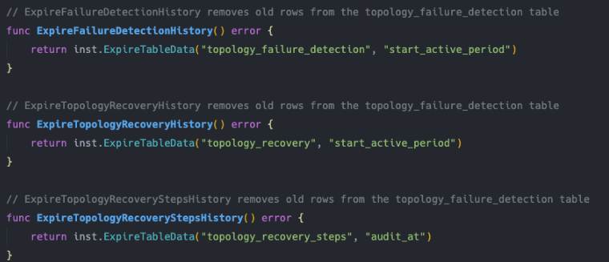
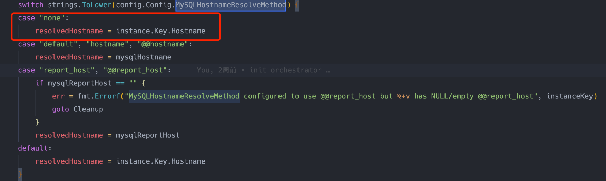
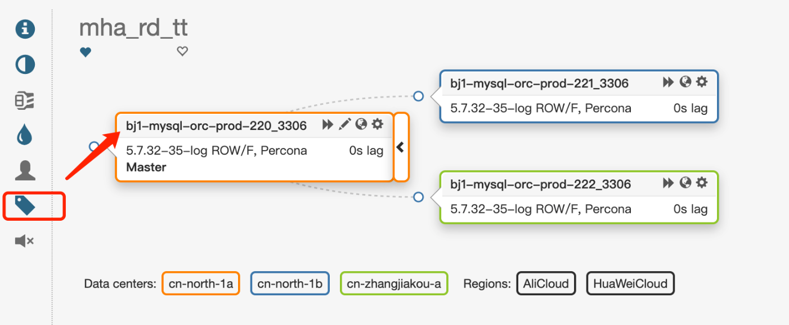

- [使用supervisor](#使用supervisor)
  - [安装supervisor](#安装supervisor)
  - [加载配置](#加载配置)
  - [启动服务](#启动服务)
- [部署Raft共识集群](#部署raft共识集群)
- [MySQL配置](#mysql配置)
- [配置半同步](#配置半同步)
- [配置ReasonableReplicationLagSeconds](#配置reasonablereplicationlagseconds)
- [配置anti-flapping](#配置anti-flapping)
- [配置集群恢复过滤](#配置集群恢复过滤)
- [配置拓扑恢复日志保存时长](#配置拓扑恢复日志保存时长)
- [配置如何发现从库](#配置如何发现从库)
- [配置恢复场景](#配置恢复场景)
- [开启超级只读](#开启超级只读)
- [配置主机名解析](#配置主机名解析)
- [配置元数据表](#配置元数据表)
  - [创建表名](#创建表名)
  - [插入数据](#插入数据)
  - [配置晋升规则](#配置晋升规则)
  - [配置region和datacenter查询](#配置region和datacenter查询)
  - [配置环境](#配置环境)
  - [配置集群别名](#配置集群别名)
  - [配置VIP](#配置vip)
- [配置复制延时](#配置复制延时)

## 使用supervisor
### 安装supervisor
```bash
yum -y install supervisor
```

### 加载配置
`vim /etc/supervisord.d/orchestrator.ini`
```ini
[program:orchestrator-raft]
user=root
autostart=true
autorestart=true
startsecs=10
directory=/usr/local/orchestrator
command=/usr/local/orchestrator/orchestrator -config /usr/local/orchestrator/conf/orchestrator.conf.raft.json http
redirect_stderr=true
stdout_logfile=/tmp/orchestrator.log
stdout_logfile_maxbytes=256MB
```

### 启动服务
```bash
> /bin/supervisord -c /etc/supervisord.conf
> supervisorctl status
orchestrator-raft                RUNNING   pid 3090, uptime 0:06:20
```

## 部署Raft共识集群
> 要求3节点,下面的操作均需要在3个节点上进行
> RaftBind绑定自己节点的ip,建议每台raft节点部署单独的MySQL节点
> 三个raft节点都需要配置orchestrator.conf.raft.json

raft参数配置（每个节点分别调整RaftBind）
```json
"#": "-----",
"#": "BackendDB相关配置",
"#": "-----",
"BackendDB": "mysql",
"MySQLOrchestratorHost": "127.0.0.1",
"MySQLOrchestratorPort": 3306,
"MySQLOrchestratorDatabase": "orchestrator",
"MySQLOrchestratorCredentialsConfigFile": "/usr/local/orchestrator/conf/.mysql.orchestrator.credentials",

"RaftEnabled": true,
"RaftDataDir": "/usr/local/orchestrator/raft",
"RaftBind": "10.10.1.220",
"DefaultRaftPort": 10008,
"RaftNodes": [
    "10.10.1.220",
    "10.10.1.221",
    "10.10.1.222"
]
```

## MySQL配置
您的 MySQL 拓扑必须满足一些要求才能支持故障转移
- 启用log_bin和log_slave_updates 
- 复制必须使用AUTO_POSITION=1 (via CHANGE MASTER TO MASTER_AUTO_POSITION=1)

主库宕机的判断依赖副本的IO复制线程，调整下面参数可以降低IO复制线程感知主库宕机的等待时长。如此，orc的DiscoverInstance可以更快的检测到最新的复制状态，将状态信息更新到表database_instance。从而GetReplicationAnalysis可以更快的检测到复制问题。

```sql
set global slave_net_timeout = 4;
在主和从之间设置较短的（2秒）心跳间隔，可以使副本快速识别故障。如果没有此设置，某些情况下可能需要一分钟才能检测到。
 
CHANGE MASTER TO MASTER_CONNECT_RETRY=1, MASTER_RETRY_COUNT=86400;
如果复制失败，副本每1秒尝试重新连接一次（默认值为60秒）对于抖动的网络问题，此设置将尝试快速恢复，如果成功，则将避免协调器进行一般的故障/恢复操作。
```

## 配置半同步
```json
"EnforceExactSemiSyncReplicas": false,
"RecoverLockedSemiSyncMaster": true,
"DetectSemiSyncEnforcedQuery": "select @@global.rpl_semi_sync_master_wait_no_slave",
"ReasonableLockedSemiSyncMasterSeconds": 10
```
- DetectSemiSyncEnforcedQuery：返回半同步优先级的查询（零表示异步副本；数字越大表示优先级越高）
- EnforceExactSemiSyncReplicas：决定是否强制执行严格的半同步副本拓扑的标志。如果启用，在LockedSemiSyncMaster 和MasterWithTooManyReplicas恢复场景下，orc将启用和禁用副本上的半同步，并根据优先级顺序精确匹配开启的半同步副本数量等于rpl_semi_sync_master_wait_for_slave_count。
- RecoverLockedSemiSyncMaster：决定是否从LockedSemiSyncMaster恢复场景中恢复的标志。如果启用，恢复LockedSemiSyncMaster 将启用（但从不禁用）副本上的半同步优先级顺序以匹配主等待计数。EnforceExactSemiSyncReplicas如果设置，此选项无效 。如果您只想处理半同步副本太少的情况，但如果有太多则不行。
- ReasonableLockedSemiSyncMasterSecondsLockedSemiSyncMaster：触发条件的秒数；如果未设置，则回退到ReasonableReplicationLagSeconds

拓扑:
```
       ,- replica1 (priority = 1, rpl_semi_sync_slave_enabled = 0)
master
       `- replica2 (priority = 1, rpl_semi_sync_slave_enabled = 0)
```
配置上面的参数，当没有副本开启半同步时，orc会开启指定数量（rpl_semi_sync_master_wait_for_slave_count）的半同步副本。假设参数rpl_semi_sync_master_wait_for_slave_count=1，有2个副本，则orc会开启一个副本的半同步，但允许管理员开启所有副本的半同步。

## 配置ReasonableReplicationLagSeconds 
如果不想太惨，建议您适当调大~
参考: [ReasonableReplicationLagSeconds](../params/ReasonableReplicationLagSeconds.md)

```json
"ReasonableReplicationLagSeconds": 120,
```

## 配置anti-flapping
orchestrator通过引入一个阻塞周期来避免抖动（级联故障导致持续中断和资源消除），在任何给定的集群上，orchesrartor不会在小于所述周期的间隔内启动自动恢复，除非有人允许这样做。

RecoveryPeriodBlockSeconds它仅适用于同一集群上的恢复。没有什么可以阻止在不同集群上运行的并发恢复。
```json
"RecoveryPeriodBlockSeconds": 3600,
```
当前集群如果在3600s内恢复过，在该阻塞周期内，该集群将不会启动自动恢复。
除非您手动确认恢复，恢复命令:
`orchestrator-client -c ack-cluster-recoveries -alias somealias -r "Manually failover"`

当然手动恢复（例如`orchestrator-client -c recover或orchstrator-client -c force-master-failover`）会忽略阻塞期。

## 配置集群恢复过滤
默认配置的集群不在恢复过滤的列表内，orchestrator将不会恢复故障的集群
如果不调整，orchestrator会一直抛出提示、且不会自动recovery
```bash
INFO executeCheckAndRecoverFunction: proceeding with DeadMaster recovery on 172.28.128.8:3306; isRecoverable?: true; skipProcesses: false
```
我这里比较省事，粗暴点
```json
"RecoverMasterClusterFilters": [
"*"
],
```

## 配置拓扑恢复日志保存时长
orc的拓扑审计日志默认保存7天，orc会每隔AuditPurgeDays清理一次表topology_recovery。这样会导致通过UI查看Audit审计时，看不到历史信息


调整参数
```json
"#": "审计日志过期天数,默认7天清理表topology_recovery",
"AuditPurgeDays": 720,
```

## 配置如何发现从库
```json
"DiscoverByShowSlaveHosts": true
```
由参数DiscoverByShowSlaveHosts控制如何发现从库，该参数默认为true
- true
通过show slave hosts发现从库，此时需要从库正确设置了report_host（report_port可以不用被设置，因为report_port默认会被设置成slave的端口）。如果从库没有设置report_host，show slave hosts中的host字段显示为空，则通过processlist发现从库。
- false
通过information_schema.processlist发现从库，SQL如下：
`select substring_index(host, ':', 1) as slave_hostname from information_schema.processlist where command IN ('Binlog Dump', 'Binlog Dump GTID');`
通过information_schema.processlist去发现从库，master无法知道replica监听的是哪个端口。show processlist只会显示复制进程使用的套接字端口，而不是replica实例监听的端口。因此需要从库和主库的监听端口一致

DiscoveryByShowSlaveHosts意义:
- MaxScale不支持PROCESSLIST，因此SHOW SLAVE HOSTS是唯一的选择
- 通过information_schema.processlist去发现从库，master无法知道replica监听的是哪个端口

## 配置恢复场景
有延时等待应用完relay-log才进行切换
```json
"DelayMasterPromotionIfSQLThreadNotUpToDate": true,
```
发生主服务器故障转移，如果候选主服务器未消耗所有中继日志，则延迟升级，直到sql线程赶上

## 开启超级只读
orchestrator默认仅设置read_only,你也可以开启超级只读支持。目前仅支持MySQL/Percona Server
```json
"UseSuperReadOnly": true,
```

## 配置主机名解析
> 如果您没有DNS系统或者不方便接入到DNS，建议您配置使用本地主机名

```json
{
   "HostnameResolveMethod": "default",
   "MySQLHostnameResolveMethod": "none",
  "DetectInstanceAliasQuery": "select concat(@@hostname, '_', @@port)",
}
```
参数：
- "HostnameResolveMethod": "cname": 通过cname解析
- "HostnameResolveMethod": "default": 不通过网络进行解析
- "MySQLHostnameResolveMethod": "@@hostname": 通过select @@hostname解析
- "MySQLHostnameResolveMethod": "@@report_host": 通过select @@report_host解析，请求从库配置@@report_host
- "HostnameResolveMethod": "none" and "MySQLHostnameResolveMethod": "": do nothing. Never resolve. This may appeal to setups where everything uses IP addresses at all times.

代码对none的定义


效果图


## 配置元数据表
> 可配置集群别名、域名(VIP)、数据中心别名等

### 创建表名
> 在所有的mysql集群的主库上创建下面表
```sql
create database orchestrator character set utf8mb4;
GRANT SELECT ON orchestrator.* TO orchestrator@'%';
 
CREATE TABLE `orchestrator`.`cluster` (
  `id` tinyint unsigned NOT NULL auto_increment,
  `env` varchar(32) NOT NULL DEFAULT '' COMMENT '环境',
  `cluster_name` varchar(128) NOT NULL DEFAULT '' COMMENT '集群名',
  `cluster_vip_domain` varchar(128) NULL DEFAULT NULL COMMENT '集群域名',
  `datacenter` varchar(128) NOT NULL DEFAULT '' COMMENT '数据中心',
  `region` varchar(128) NOT NULL DEFAULT '' COMMENT '区域',
  `hostname` varchar(128) NOT NULL DEFAULT '' COMMENT '主机名',
  `port` int(11) NOT NULL DEFAULT '0' COMMENT '端口',
  `promotion_rule` varchar(128) NOT NULL DEFAULT 'prefer' COMMENT '晋升规则，可选值：prefer/neutral/prefer_not/must_not',
  `D_UPDATED_AT` datetime NOT NULL DEFAULT CURRENT_TIMESTAMP ON UPDATE CURRENT_TIMESTAMP COMMENT '更新时间',
  `D_CREATED_AT` datetime NOT NULL DEFAULT CURRENT_TIMESTAMP COMMENT '创建时间',
  PRIMARY KEY (`id`)
) ENGINE=InnoDB DEFAULT CHARSET=utf8 COMMENT='orchestrator实例元数据表'
```

### 插入数据
> 如果没有vip，插入NULL即可

插入测试数据
```sql
INSERT INTO
    `cluster`
VALUES
    (
        1,
        'prod',
        'mha_rd_tt',
        'prod_tt.proxysql.rd.mysql.local',
        'cn-north-1a',
        'HuaWeiCloud',
        'bj1-mysql-orc-prod-220',
        3306,
        'prefer',
        '2022-05-23 14:12:16',
        '2022-05-17 11:00:21'
    ),
(
        2,
        'prod',
        'mha_rd_tt',
        'prod_tt.proxysql.rd.mysql.local',
        'cn-north-1b',
        'HuaWeiCloud',
        'bj1-mysql-orc-prod-221',
        3306,
        'prefer',
        '2022-05-23 14:12:16',
        '2022-05-17 11:00:21'
    ),
(
        3,
        'prod',
        'mha_rd_tt',
        'prod_tt.proxysql.rd.mysql.local',
        'cn-zhangjiakou-a',
        'AliCloud',
        'bj1-mysql-orc-prod-222',
        3306,
        'must_not',
        '2022-05-23 14:09:45',
        '2022-05-17 11:00:22'
    );
```

### 配置晋升规则
> 不需要用恶心的定时任务了

```json
"DetectPromotionRuleQuery": "select promotion_rule from orchestrator.cluster where hostname=@@hostname",
```

### 配置region和datacenter查询
```json
"DetectDataCenterQuery": "select datacenter from orchestrator.cluster where hostname=@@hostname",
"DetectRegionQuery": "select region from orchestrator.cluster where hostname=@@hostname",
```

### 配置环境
```json
"DetectPhysicalEnvironmentQuery": "select env from orchestrator.cluster where hostname=@@hostname",
```

### 配置集群别名
```json
"DetectClusterAliasQuery": "select cluster_name from orchestrator.cluster where hostname=@@hostname",
```

### 配置VIP
参考: [VIP解决方案](../enhancements/VIP解决方案.md)
```json
"DetectClusterDomainQuery": "select cluster_vip_domain from orchestrator.cluster where hostname=@@hostname",
"PostFailoverProcesses": [
    "/usr/local/orchestrator/orc_change_vip -vip_domain {failureClusterDomain} -new_master_ip {successorHost} -endpoints 10.10.1.220:2379",
    "echo '(for all types) Recovered -- {failureClusterDomain} -- from {failureType} on {failureCluster}. Failed: {failedHost}:{failedPort}; Successor: {successorHost}:{successorPort}' >> /tmp/recovery.log"
],
```

## 配置复制延时
下面以pt-heartbeat输出格式为参考
```sql
mysql> select * from orchestrator.heartbeat;
+----------------------------+-----------+------------------+----------+-----------------------+---------------------+
| ts                         | server_id | file             | position | relay_master_log_file | exec_master_log_pos |
+----------------------------+-----------+------------------+----------+-----------------------+---------------------+
| 2021-01-30T01:13:16.804990 |   2233306 | mysql-bin.000003 |  1486842 | NULL                  |                NULL |
+----------------------------+-----------+------------------+----------+-----------------------+---------------------+
1 row in set (0.00 sec)
```

配置使用读取延时
```json
"ReplicationLagQuery": "select timestampdiff(second, ts, now()) from orchestrator.heartbeat;",
```