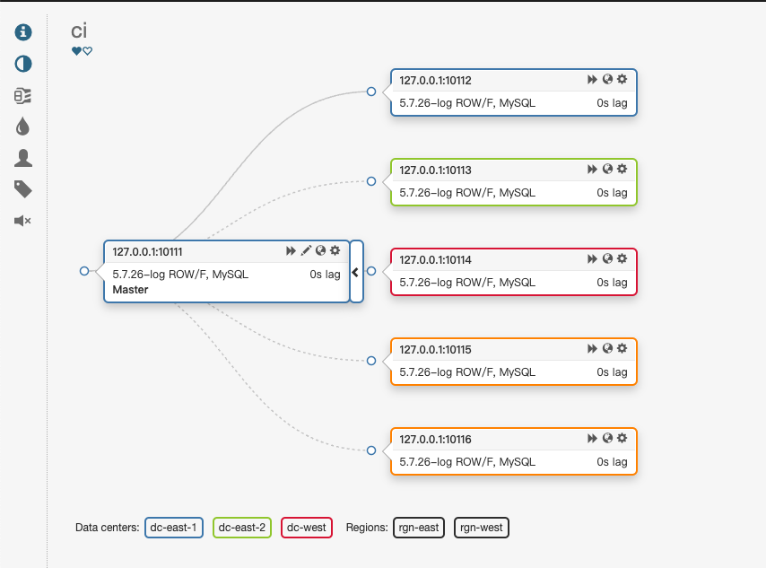
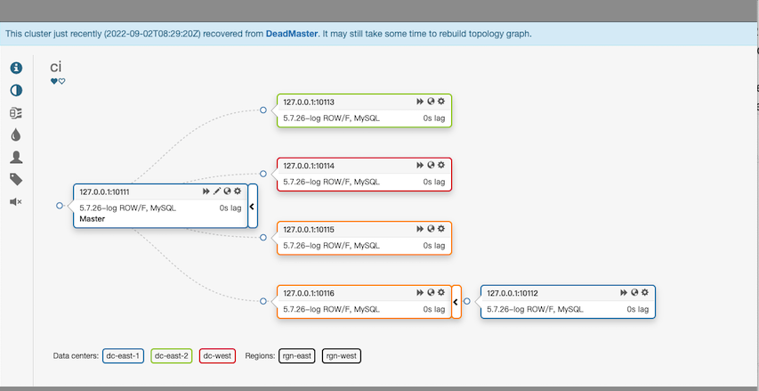
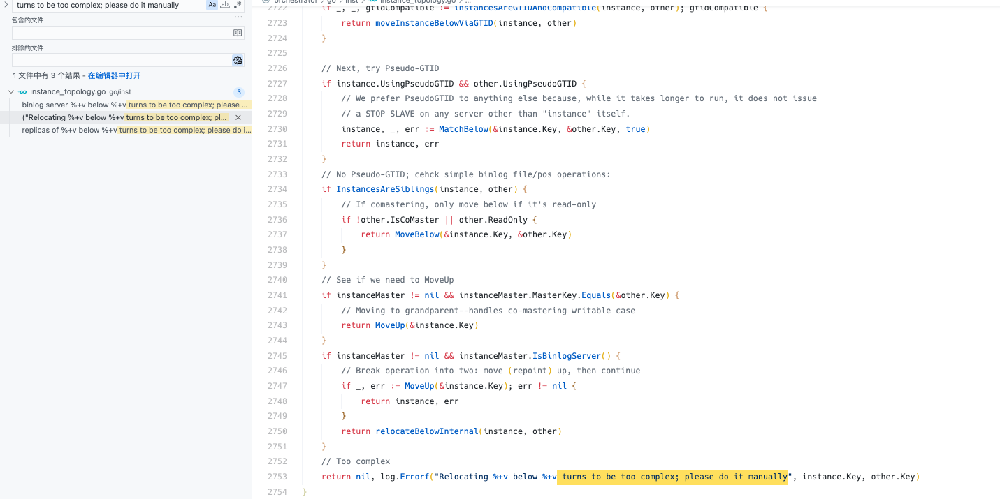

## 拓扑



## 执行切换
```bash
orchestrator-client -c graceful-master-takeover-auto -alias ci -d 127.0.0.1:10115 -b 'zongfei.fu:1234.com'
```

## 报错
`graceful-master-takeover-auto`切换失败

### 失败后的拓扑
> 我们发现切换失败了，心里慌得一批，为什么总是我？卧槽，又遇到bug了？



### 失败的日志
```
2022-09-02 16:40:59 INFO moveReplicasViaGTID: Will move 3 replicas below 127.0.0.1:10116 via GTID, max concurrency: 5
2022-09-02 16:40:59 ERROR Relocating 3 replicas of 127.0.0.1:10111 below 127.0.0.1:10116 turns to be too complex; please do it manually
[martini] Completed 500 Internal Server Error in 134.096188ms
```

### 分析
1. 发现实例`127.0.0.1:10112`切换为了`127.0.0.1:10116`的从库，表明`127.0.0.1:10112`可以正常切换
2. 实例`127.0.0.1:10113`、`127.0.0.1:10114`、`127.0.0.1:10115`没有正常切换到`127.0.0.1:10116`下面，why？

我们需要思考下是什么阻碍了切换？我们看下日志，发现关键信息`turns to be too complex; please do it manually`。

看下代码

不看也罢，代码没有输出这个错误。

### 原因
为什么会出现这种切换不成功的原因呢？因为`server_id`一致导致的，为什么会出现server_id一致呢，原因是`127.0.0.1:10113`、`127.0.0.1:10114`、`127.0.0.1:10115`实例是从备份实例`127.0.0.1:10116`还原的，配置文件未进行修改导致的。

## 什么情况会出现这个问题？
- `server_id`一致
- 从库没有开启`log_slave_updates`
  
应该还有其他情况，我没有细看，目前我遇到这2种情况，就记录下来了

## 如何避免？
> 发现问题不可怕，可怕的是不做好兜底检查

增加巡检项，定期扫描`server_id`和`log_slave_updates`参数