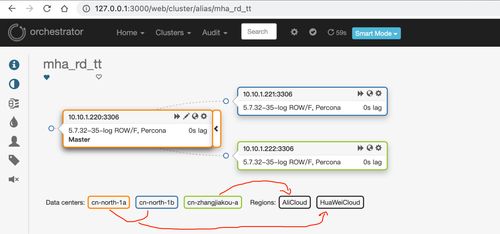
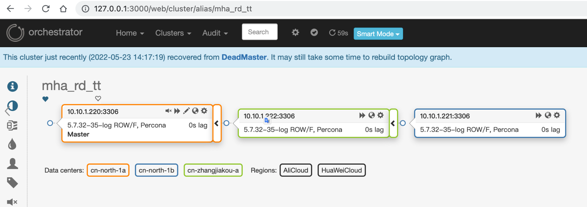

- [region和datacenter](#region和datacenter)
  - [region](#region)
  - [datacenter](#datacenter)
- [举例](#举例)
  - [拓扑](#拓扑)
  - [配置](#配置)
  - [手动测试恢复](#手动测试恢复)
- [fixbug](#fixbug)

## region和datacenter
orchestrator支持标记集群内实例的区域和数据中心,支持恢复只在同一个region或数据中心之内进行。

### region
地域，可以理解为跨地域部署，比如灾备，阿里杭州和张家口

### datacenter
数据中心，可以理解为多个数据中心。比如同城多机房，华为云多AZ

## 举例
### 拓扑


region:
    - AliCloud和HuaWeiCloud
datacenter:
    - 可用区

从拓扑可以看出：
1. 跨云部署，分别为AliCloud和HuaWeiCloud
2. 华为云跨多个AZ部署，分别为:cn-north-1a、cn-north-1b
3. 三台数据库实例分布在华为云2个可用区和阿里云一个可用区

### 配置
允许跨datacenter恢复，不允许跨region恢复。即HuaWeiCloud region内跨datacenter部署的允许恢复。

```json
"PreventCrossDataCenterMasterFailover": false,
# 默认false，当为true时，Orchestrator只会使用同一个数据中心下的服务器进行恢复。如果在同一DC中找不到，那么恢复就会失败。
 
"PreventCrossRegionMasterFailover": true,
# 默认false，当为true时，Orchestrator将会在同一区域内的服务器上进行故障恢复，如果找不到，那么恢复就会失败。
```

### 手动测试恢复
手动恢复会失败，因为不允许跨region恢复(执行强制恢复也是不行的)

```bash
 ~/Documents/GitProjects/orchestrator/ [fzf] orchestrator-client -c graceful-master-takeover-auto -alias mha_rd_tt -d 10.10.1.222:3306
GracefulMasterTakeover: Recovery attempted yet no replica promoted; err=RecoverDeadMaster: failed 10.10.1.222:3306 promotion; PreventCrossRegionMasterFailover: will not promote server in AliCloud when failed server in HuaWeiCloud
```
此时恢复会失败，原因是不允许跨数据中心恢复，上面设置了参数PreventCrossRegionMasterFailover为True
但是MySQL的拓扑会发生变化，形成级联关系（划重点）!!!



## fixbug
请参考文档【bug-启用region或datacenter后failover偶尔会失败】