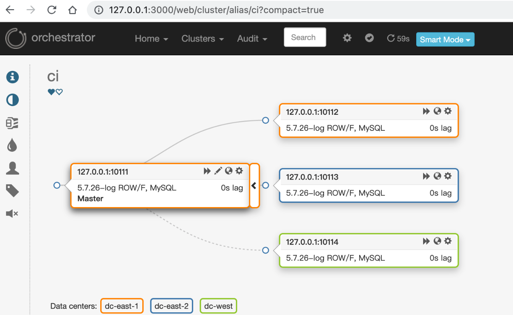

- [概述](#概述)
- [克隆orchestrator-ci-env](#克隆orchestrator-ci-env)
- [启动docker ci环境](#启动docker-ci环境)
- [启动开发环境的ORC](#启动开发环境的orc)
- [docker容器内mysql](#docker容器内mysql)
- [查看UI拓扑](#查看ui拓扑)

## 概述
快速构建一套mysql拓扑测试环境，便于本地orc调试和开发。

## 克隆orchestrator-ci-env
```bash
# 进入到Orchestrator的本地开发目录，待会构建时，会copy当前目录的代码到docker容器里进行build
cd orchestrator
git clone https://github.com/openark/orchestrator-ci-env.git
```

## 启动docker ci环境
```bash
cd orchestrator-ci-env
sudo ./script/dock
```
docker会启动如下服务
- A replication topology via DBDeployer, with heartbeat injection
- HAProxy
- Consul
- consul-template

Docker will expose these ports:
- 10111, 10112, 10113, 10114: MySQL hosts in a replication topology. Initially, 10111 is the master.
- 13306: exposed by HAProxy and routed to current MySQL topology master.

## 启动开发环境的ORC
> 使用orchestrator-ci-system.conf.json配置，参数可以自行调整
> orc服务会自动探测到docker容器里面的orc拓扑

```bash
go run go/cmd/orchestrator/main.go -config tests/system/orchestrator-ci-system.conf.json -debug http
```

## docker容器内mysql
账号密码:ci/ci
```bash
mysql -uci -pci -h127.0.0.1 -P10111访问
```

## 查看UI拓扑


通过此方式，您可以快速构建出一套ci拓扑，如此您可以边进行开发边进行测试了