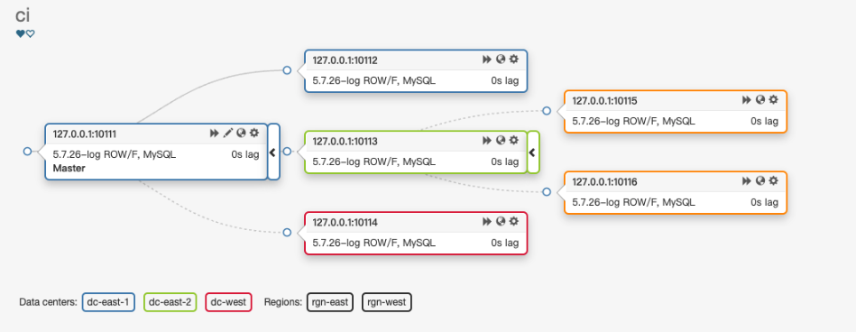

- [级联](#级联)
  - [拓扑](#拓扑)
  - [参数配置](#参数配置)
- [手动切换](#手动切换)
- [故障自动切换](#故障自动切换)
- [级联Master节点故障（目前在使用）](#级联master节点故障目前在使用)
- [配置RecoverIntermediateMasterClusterFilters匹配当前集群](#配置recoverintermediatemasterclusterfilters匹配当前集群)
- [拓扑+复制过滤](#拓扑复制过滤)
  - [级联Master+复制过滤](#级联master复制过滤)
  - [非级联拓扑+复制过滤](#非级联拓扑复制过滤)


## 级联
### 拓扑

级联部分为：10.10.1.1:10113，10.10.1.1:10115，10.10.1.1:10116

### 参数配置
> 下面参数意味着当级联Master故障，不允许级联的Master的拓扑恢复

```json
# 匹配到指定字符的级联master允许恢复
# 下面对咱们业务来讲，当级联Master故障，不允许级联Master的拓扑恢复
"RecoverIntermediateMasterClusterFilters": [
    "_intermediate_master_pattern_"
],
```

## 手动切换
> 结论：手动切换不会改变级联拓扑，级联Master会自动change到新Master

晋升副本：127.0.0.1:10112
```
/resources/bin/orchestrator-client -c graceful-master-takeover-auto -i 127.0.0.1:10112
127.0.0.1:10112
```

切换后拓扑


## 故障自动切换
> 结论：故障自动切换不会改变级联拓扑，级联Master会自动change到新Master

将Master节点宕机（127.0.0.1:10111）
```
mysql -uci -pci -h 127.0.0.1 --port 10111 -e "shutdown"
```

切换后的拓扑


## 级联Master节点故障（目前在使用）
> 结论：
> 1.级联Master的拓扑不会发生变化，不会自动恢复，可手动确认恢复
> 2. 当前拓扑仍然支持故障恢复，比如Master节点宕机（127.0.0.1:10111）

配置RecoverIntermediateMasterClusterFilters过滤掉当前集群
```json
# 匹配到指定字符的级联master允许恢复
# 下面对咱们业务来讲，当级联Master故障，不允许级联Master的拓扑恢复
"RecoverIntermediateMasterClusterFilters": [
    "_intermediate_master_pattern_"
],
```
将级联Master节点宕机（127.0.0.1:10113）
```
mysql -uci -pci -h 127.0.0.1 --port 10113 -e "shutdown"
```

切换后的拓扑


将Master节点宕机（127.0.0.1:10111）
```
mysql -uci -pci -h 127.0.0.1 --port 10111 -e "shutdown"
```

恢复后的拓扑（会形成2个拓扑）


## 配置RecoverIntermediateMasterClusterFilters匹配当前集群
> 结论：级联Master的拓扑会自动恢复，级联Master的副本会被转移到其他副本下

```json
# 允许所有的级联master拓扑恢复
"RecoverIntermediateMasterClusterFilters": [
    "*"
],
```

将级联Master节点宕机（127.0.0.1:10113）
```
mysql -uci -pci -h 127.0.0.1 --port 10113 -e "shutdown"
```

恢复后的拓扑


## 拓扑+复制过滤
### 级联Master+复制过滤
如果级联Master配置了复制过滤，问题会复杂些。
比如级联Master配置了复制过滤，仅允许部分表同步，但是级联Master下面的副本又没配置复制过滤。
那么此时就不应该允许级联拓扑进行自动恢复

### 非级联拓扑+复制过滤
在非级联的主从拓扑结构中，不应该对其中一个副本配置复制过滤，否则会导致选主时，如果选中该副本，会造成数据丢失。当然，也是允许这种情况，应设置该台副本的晋升规则为must_not